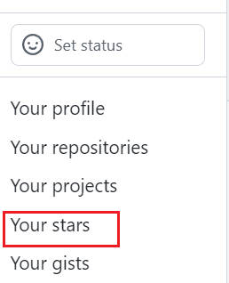

# github_intro
briefly introduce some operations of github

增加初次使用github时对界面和操作的熟悉度，文档随时补充~

## 1.项目操作按钮说明

### 1.1 watch

默认为只有参与或@别人时才会接受到消息。如果选择`All Activity`，项目变动的消息如issue,comment等都会通知到个人，gihub消息中心也会有提示。当然推荐设置邮箱接受信息，具体的邮箱设置可参看[如何正确接收 GitHub 的消息邮件](https://github.com/cssmagic/blog/issues/49)。

### 1.2 star

类似于对项目的点赞功能，选择start后会在自己的账号下的`Your stars`中显示，同时类似于收藏链接的功能。不过官方暂时没有提供对star的分类功能，收藏过多可能会显得繁杂。

### 1.3 fork

一般来说，fork是对**当时库**的全方位拷贝，也不仅包含文本代码，而且包含有库中的所有提交记录等。fork某个库后，则创建了完全属于自己的拷贝库，自己可以在上面任意修改，当然也可以通过Pull Request向原来的库提交合并请求。fork的缺点是仅限于**当时的拷贝**，如果以后库的信息内容发生变更，则需要重新fork获取最新情况。

如果仅想收藏，还是推荐star。

